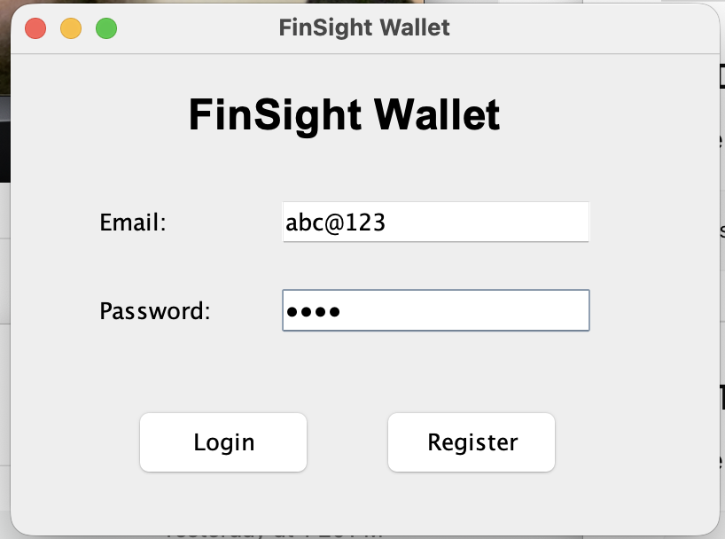
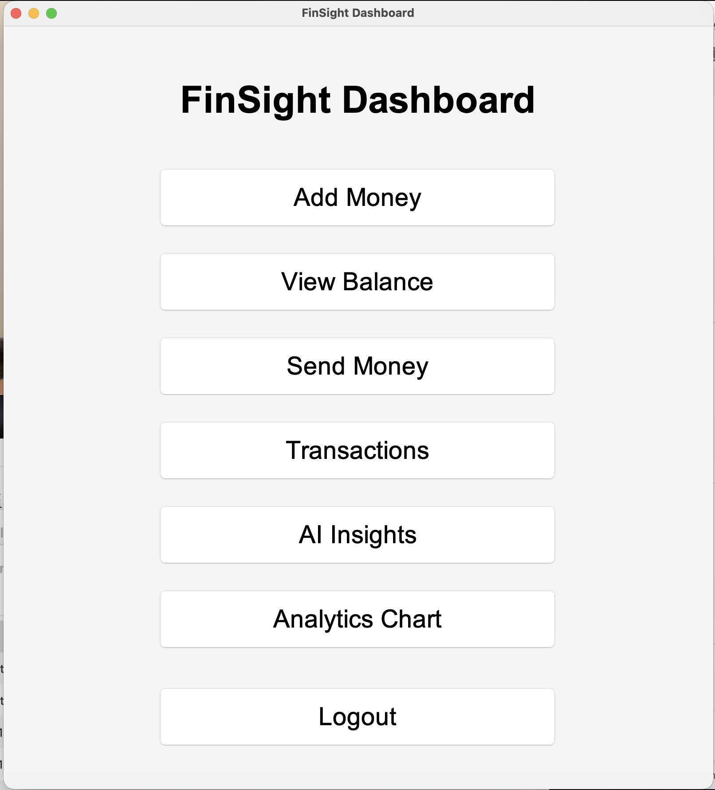
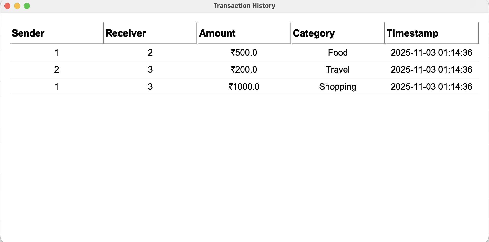
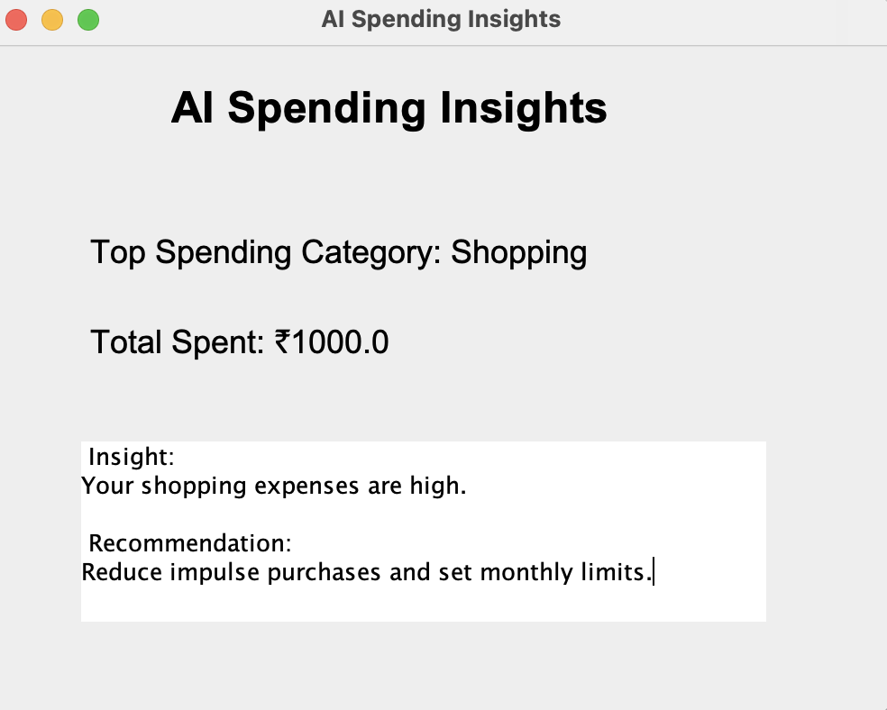
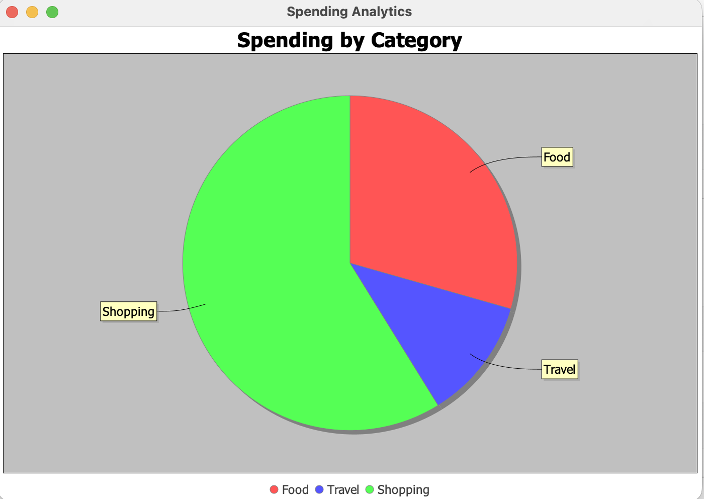

#  FinSight Wallet

AI-powered full-stack fintech wallet application built using Java Swing, JDBC, MySQL, and JFreeChart.

---

#  Overview

FinSight Wallet is a desktop-based fintech application inspired by modern digital wallet platforms like Paytm, PhonePe, and Google Pay.

The application enables:
- Secure authentication
- Wallet management
- Peer-to-peer transactions
- AI-powered spending insights
- Financial analytics visualization

---

#  Features

##  Authentication
- User registration
- Secure login system
- Database-backed authentication

##  Wallet Features
- Add money
- View wallet balance
- Real-time balance updates

##  Transactions
- Send money between users
- Transaction history tracking
- Category-based spending

##  AI Insights
- Highest spending category analysis
- Smart budgeting recommendations
- Spending pattern detection

##  Analytics Dashboard
- Pie-chart financial analytics
- Category-wise expense visualization
- JFreeChart integration

##  Modern GUI
- Java Swing dashboard
- Interactive interface
- Styled transaction tables

---

#  Tech Stack

| Technology | Usage |
|---|---|
| Java | Backend Logic |
| Java Swing | Frontend GUI |
| MySQL | Database |
| JDBC | Database Connectivity |
| JFreeChart | Analytics Visualization |
| Git & GitHub | Version Control |

---

#  System Architecture

```text
Java Swing GUI
       ↓
Java Backend
       ↓
JDBC
       ↓
MySQL Database
```

---

#  Database Schema

## Users Table

| Column | Type |
|---|---|
| user_id | INT |
| name | VARCHAR |
| email | VARCHAR |
| password | VARCHAR |
| wallet_balance | DECIMAL |

---

## Transactions Table

| Column | Type |
|---|---|
| txn_id | INT |
| sender_id | INT |
| receiver_id | INT |
| amount | DECIMAL |
| category | VARCHAR |
| timestamp | TIMESTAMP |

---

#  Screenshots

##  Login Page



---

##  Dashboard



---

##  Transactions Page



---

##  AI Insights



---

##  Analytics Chart



---

#  Setup Instructions

## 1️⃣ Clone Repository

```bash
git clone https://github.com/tanisha-ahl/FinSight-Wallet.git
```

---

## 2️⃣ Navigate to Project

```bash
cd FinSight-Wallet
```

---

## 3️⃣ Add Required Libraries

Place the following JAR files inside the `lib/` folder:

- mysql-connector-j
- jfreechart
- jcommon

---

## 4️⃣ Configure MySQL Database

Create database:

```sql
CREATE DATABASE fintech_wallet;
```

Create tables using MySQL Workbench.

---

## 5️⃣ Compile Project

```bash
javac -cp "lib/*" src/backend/*.java src/gui/*.java src/Main.java -d .
```

---

## 6️⃣ Run Application

```bash
java -cp ".:lib/*" gui.LoginPage
```

---

#  Future Improvements

- Dark mode support
- Cloud database deployment
- Budget goal tracking
- OTP-based authentication
- Expense prediction using Machine Learning
- Mobile application version

---

#  Learning Outcomes

This project demonstrates:
- Full-stack Java development
- GUI-based desktop application design
- JDBC database integration
- SQL query handling
- Data visualization
- Event-driven programming
- FinTech workflow implementation

---

# 📂 Project Structure

```text
FinSight-Wallet/
│
├── lib/
│
├── screenshots/
│
├── src/
│   ├── backend/
│   └── gui/
│
├── README.md
└── .gitignore
```

---

# 👩‍💻 Author

Tanisha Ahlawat

B.Tech – Electrical and Computer Science Engineering

